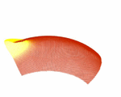

# membraneSphere

membraneSphere is a software package to simulate waves on a spherical membrane.
It implements the membrane wave method introduced by Tanimoto (1990).
Membrane waves are an analogue for seismic surface waves.
The zero-thickness sphere is discretized by a geodesic grid (Tape, 2003).
Wave propagation on this sphere is solved by a finite-difference scheme for such hexagonal grids (Tape, 2003; Heikes & Randall, 1995a).

The theory behind this software implementation of the membrane waves is explained in these publications:

* *Peter, D., C. Tape, L. Boschi and J. H. Woodhouse*, 2007. 
  **Surface wave tomography: global membrane waves and adjoint methods**, 
  Geophys. J. Int., 171: p. 1098-1117. 
  [doi:10.1111/j.1365-246X.2007.03554.x]( https://doi.org/10.1111/j.1365-246X.2007.03554.x)

* *Tape, C. H.*, 2003. 
  **Waves on a Spherical Membrane**, 
  M.Sc. thesis, University of Oxford, U.K. 
  [thesis membrane](https://sites.google.com/alaska.edu/carltape/home/research/thesis_membrane)

---

## Quick start

### Infos about the repository folders

- `data/griddata/`

    holds the data for the grid construction

- `data/phasedata/`

    has two examples of phase speed models which can be used for a heterogeneous
    background earth in the membrane wave simulation

- `src/propagation/`

    the main executables propagation, timelag & adjointMethod are located therein

- `src/include/`

    contains source files for routines

### Main executables are in the folder `src/propagation/`

* **propagation.f90**  -  forward modeling of membrane waves

    The main program 'propagation' calculates a simulation of membrane waves
    propagating over a sphere.

    It reads the main input file Parameter_Input. Other parameters can be set
    in the `commonModules.f90` file.

    File output is the seismogram
    (format: time/displacement, time in seconds),
    written in the data directory given in Parameter_Input.

    For checking, it also outputs the used phase map
    (format: longitude/latitude/phasespeed)
    and the phase speed squared at the vertices
    (format: verticeID/phasespeedsquared).

    Visualization of the seismograms can be done with the GNUPLOT application.
    The scripts/ folder holds a bash-script for visualization of the
    phase map with GMT.

* **adjointMethod.f90**  -  kernel construction by membrane waves

    The executable performs a simulation, where no scatterer is present,
    and calculates the adjoint source.
    Then it makes a time-reversed simulation and computes the kernel values.

    It reads the main input file `Parameter_Input`. Other parameters can be set
    in the `commonModules.f90` file.

    The kernel values are written to a file in the data directory given in `Parameter_Input`
    (format: longitude/latitude/kernelvalue/vertexID).
    Kernel values are evaluated at the vertices of the spherical membrane grid only.
    The kernel-file name can be set in `Parameter_Input` as well.

    To visualize the kernel, there are two bash-scripts in the `scripts/` folder
    using GMT. These scripts `gmtplot_2Dkernel.sh` (plot as 2D map) and
    `gmtplot_3Dkernel.sh` (plot in 3D perspective) interpolate the kernel file
    and output cross-sections at different longitudes as well.

* **timelag.f90**  -  phase shift/time shift of two seismograms

    This utility program calculates the time lag between two seismograms.

    It reads only the input file `Timelag_Input`. Other parameters (especially
    the filter parameters) are taken from `commonModules.f90`.

    The time shift result is written to the console.

* **heterogeneousPhaseshift.f90** - synthetic phase-shift calculations

    This program outputs a synthetic database of phase-shift measurements
    for any heterogeneous input model.

    Given a source/station file specified in the `Parameter_Input` file,
    it numerically calculates the phase shift
    for each particular setup, based on cross-correlations between a
    reference trace (PREM) and the synthetic trace for any heterogeneous
    background phase-velocity model.

### Parameters to change on different machines

- codes are written in Fortran90, use the appropriate compiler flags
  in the Makefile by setting F90, FFLAGS, LDFLAGS

- in `src/include/commonModules.f90` you have to choose precision (use single,
  it'll do it), source parameters (see Carl Tape's thesis) and filter parameters.
  There are also a few others, but defaults should do it.

- in `src/propagation/Parameter_Input` choose the physical model (grid refinement level,
  simulation times and wave type) and set the source/receiver geometry.
  You can also place a scatterer and use a heterogeneous background phase
  speed model

Note: Subroutines from "Numerical Recipes: The Art of Scientific Computing"
      by W. H. Press et al., Cambridge University Press, are used in
      numericalRecipes*.f90. The user must acquire an official
      Numerical Recipes license to run them.
