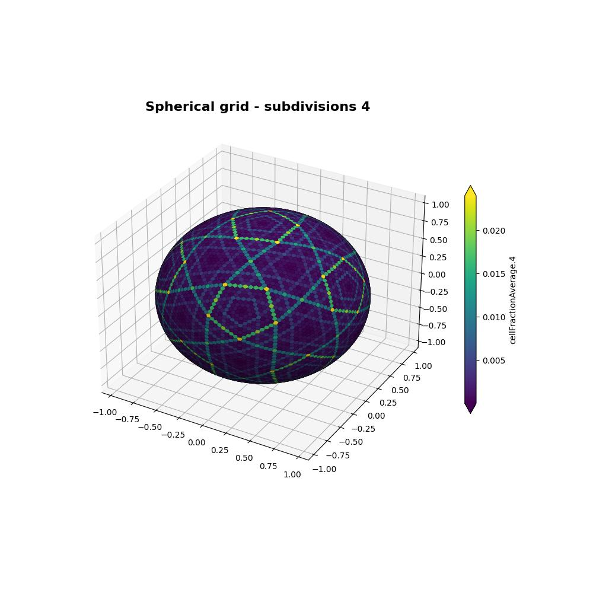

# Spherical grid construction

This folder holds scripts to create the spherical grids used for the membrane wave simulations.
The grid construction is based on the refinement of a dodecahedron-icosahedron solid.

To calculate a spherical grid up to a certain refinement level, e.g., up to 6 refinements, you would run:
```
$ ./run_grid_construction_level.sh 6
```

We also use pre-calculated cell areas to speed up simulations.
You can compute those by specifying the level for which the cell statistics should be computed.
For example, for grid level 6, type:
```
$ ./run_grid_statistics.sh 6
```

All output files can be found in folder `OUTPUT/`.
We provide these grids up to level 6 in the package folder `data/griddata/`.


For higher refinement levels, you can create them here and place them into that folder such that the wave simulation binaries can find them.
Note that the maximum refinement level is 12 due to the limit of 32-bit integers.


## Visualization



For visualizing a spherical grid output, a corresponding script can be run.
For example, to visualize the cell fraction average for grid level 4, use:
```
$ ./plot_3Dgrid.sh 4
```
